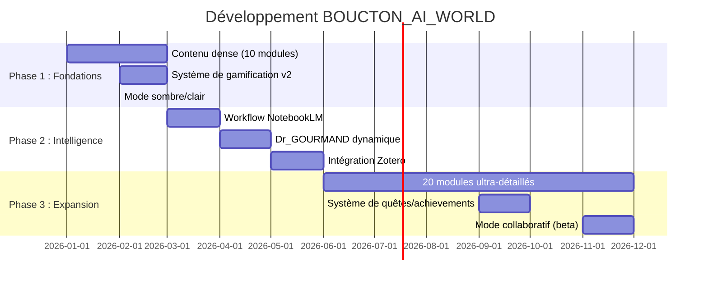

# 🗺️ ROADMAP — BOUCTON_AI_WORLD

**Version actuelle** : 1.1 (Prototype)  
**Dernière mise à jour** : 2026-01-09  
**Vision** : Écosystème encyclopédique intelligent pour l'apprentissage augmenté par IA

---

## 🎯 PHILOSOPHIE DU PROJET

> "Un cerveau documentaire (Markdown), un corps interactif (HTML), un système de prompting avancé (META-AI), et un terrain d'expérimentation IA sérieux."

**Principes directeurs** :
- ✅ **Contenu > Technologie** : La forme suit le fond
- ✅ **Incrémental** : On ajoute, on n'efface jamais
- ✅ **IA-agnostique** : Compatible Gemini, Mistral, GPT, Claude, NotebookLM
- ✅ **Human-centric** : L'IA est un instrument, pas une autorité

---

## 📅 TIMELINE GÉNÉRALE



---

## 🚀 PHASE 1 : FONDATIONS (Mois 1-3)

### ✅ Déjà Réalisé (J+1)
- [x] Architecture modulaire React + Vite
- [x] 5 modules squelettes (TUTO_MIEL, CODEX_AI, META_IA, Dr_GOURMAND, BIBLIO_GOURMANDE)
- [x] Système XP basique
- [x] Launchpad IA (liens rapides)
- [x] Carnet de bord (localStorage)

### 🔄 En Cours
- [ ] **CONTENU_ENGINE** : Générer 10 modules détaillés (5000+ lignes/module)
  - Priorité 1 : Dr_GOURMAND (20 scénarios cliniques complets)
  - Priorité 2 : BIBLIO_GOURMANDE (500 références Zotero)
  - Priorité 3 : CODEX_AI (200 prompts testés et catégorisés)

### 🎯 Objectifs Phase 1
- [ ] **Mode Clair/Sombre** : Toggle dans Header
- [ ] **Système de Progression** : Barres de progression par module
- [ ] **Amélioration UX** :
  - Feedback visuel sur actions (toasts, animations)
  - Navigation clavier (accessibilité WCAG 2.1 AA)
  - Optimisation mobile (même si 90% desktop)

---

## 🤖 PHASE 2 : INTELLIGENCE (Mois 4-6)

### Workflow NotebookLM Intégré
**Objectif** : Pipeline automatisé entre BOUCTON_AI_WORLD et NotebookLM

**Features** :
- Bouton "Générer Podcast" sur chaque module
- Export automatique Markdown → PDF → Upload NotebookLM
- Récupération des synthèses audio (player intégré)

**Limitations** : NotebookLM n'a pas d'API publique → Workflow semi-manuel

---

### Dr_GOURMAND v2.0 : Simulateur Dynamique
**Objectif** : Transformer les prompts statiques en expérience interactive

**Architecture proposée** :
```javascript
// Pas d'API IA payante → Solution alternative
const generateScenario = () => {
  // 1. Générer cas via algorithme local (JSON database)
  // 2. Bouton "Analyser avec IA" → Ouvre Gemini avec prompt pré-rempli
  // 3. Utilisateur copie-colle la réponse IA dans le site
  // 4. Parsing de la réponse → Affichage structuré
}
```

**Features** :
- 🎲 Base de données de 100+ pathologies (JSON local)
- ⏱️ Horloge virtuelle temps réel
- 📊 Système de scoring détaillé
- 🏆 Achievements débloquables (badges, titres)

---

### Intégration Zotero
**Objectif** : Synchroniser la bibliographie automatiquement

**Workflow** :
1. Export Zotero → JSON (manuel ou via script Python)
2. Placement du JSON dans `/data/biblio/`
3. Génération automatique de fiches de lecture via le site
4. Bouton "Synthétiser avec NotebookLM" par article

---

## 🌍 PHASE 3 : EXPANSION (Mois 7-12)

### Contenu Encyclopédique
**Objectif** : 20 modules ultra-détaillés (1000+ lignes chacun)

**Nouveaux domaines** :
- 🔭 **ASTRO_QUEST** : Astrophysique (trous noirs, cosmologie, exoplanètes)
- 📚 **BIBLIO_UNIVERSALIS** : Littérature (analyse de romans, poésie, essais)
- 🧠 **PHILO_LAB** : Philosophie (courants, penseurs, débats contemporains)
- 🎯 **QUIZ_ARENA** : Culture générale (questions aléatoires, scoring)
- 🎨 **CREATIVE_STUDIO** : Génération créative assistée par IA

---

### Système de Quêtes
**Objectif** : Gamification avancée avec progression narrative

**Exemples de quêtes** :
- 🏥 **"Le Diagnostiqueur"** : Résoudre 10 cas Dr_GOURMAND sans erreur
- 📖 **"Bibliophile"** : Lire 50 articles de BIBLIO_GOURMANDE
- 🌌 **"Explorateur Cosmique"** : Compléter tous les modules ASTRO_QUEST
- 🎭 **"Poète du Code"** : Générer 20 prompts CODEX_AI de qualité

**Récompenses** :
- Déblocage de sections secrètes (ex: Recueil Paul Valéry analysé par IA)
- Personnalisations graphiques (thèmes, avatars)
- Titres honorifiques ("Professeur IA", "Architecte Système")

---

### Mode Collaboratif (Beta)
**Objectif** : Partage avec amis/collègues proches

**Features minimalistes** :
- Code d'accès unique par utilisateur (pas de vrai auth)
- Export/Import de profils (JSON)
- Partage de notes et prompts favoris
- Leaderboard privé (optionnel)

---

## 🛠️ BACKLOG TECHNIQUE

### Optimisations Performances
- [ ] Lazy loading des modules (React.lazy)
- [ ] Code splitting par route
- [ ] Service Worker pour mode offline (PWA)
- [ ] Compression images (WebP)

### Qualité Code
- [ ] Tests unitaires (Vitest)
- [ ] Linter strict (ESLint + Prettier)
- [ ] Documentation JSDoc
- [ ] CI/CD automatisé (GitHub Actions)

### Sécurité
- [ ] Content Security Policy (CSP)
- [ ] Rate limiting sur formulaires
- [ ] Validation inputs (sanitization)

---

## 📊 MÉTRIQUES DE SUCCÈS

**Phase 1** (Mois 3) :
- ✅ 10 modules avec contenu dense (5000+ lignes)
- ✅ 50+ prompts testés et validés
- ✅ Système XP v2 opérationnel

**Phase 2** (Mois 6) :
- ✅ Pipeline NotebookLM fonctionnel
- ✅ Dr_GOURMAND avec 20 scénarios
- ✅ 500+ références Zotero intégrées

**Phase 3** (Mois 12) :
- ✅ 20 modules ultra-détaillés
- ✅ Système de quêtes complet
- ✅ 3+ utilisateurs beta testeurs

---

## 🤝 CONTRIBUTION

**Actuellement** : Projet personnel (développement solo)  
**À terme** : Ouverture à des contributeurs de confiance (collègues, amis)

**Comment contribuer** (futur) :
1. Proposer du contenu via Issues GitHub
2. Soumettre des prompts via Pull Request
3. Signaler bugs/améliorations
4. Tester les nouvelles features en beta

---

## 📚 RESSOURCES EXTERNES

**IA utilisées** :
- [Gemini AI](https://gemini.google.com) (raisonnement, créativité)
- [Mistral Le Chat](https://chat.mistral.ai) (logique, code)
- [NotebookLM](https://notebooklm.google.com) (synthèse bibliographique)
- [ChatGPT](https://chat.openai.com) (polyvalence)

**Outils de gestion** :
- [Zotero](https://www.zotero.org) (bibliographie)
- [GitHub](https://github.com/boucton/BOUCTON_AI_WORLD) (versionnage)
- [Obsidian](https://obsidian.md) (notes personnelles)

---

## 🔮 VISION LONG TERME (2027-2030)

- 🌍 **Multilingue** : Version anglaise complète
- 🎓 **Certifications** : Parcours validés avec attestations
- 🤖 **IA Personnalisée** : Agent IA apprenant des préférences utilisateur
- 📱 **Application Mobile** : Version iOS/Android native
- 🌐 **API Publique** : Accès aux données pour chercheurs

---

**Mise à jour régulière** : Ce document évolue avec le projet.  
**Feedback** : Toute suggestion est bienvenue via Issues GitHub.

---

*"Rome ne s'est pas construite en un jour, mais chaque pierre a été posée avec intention."*